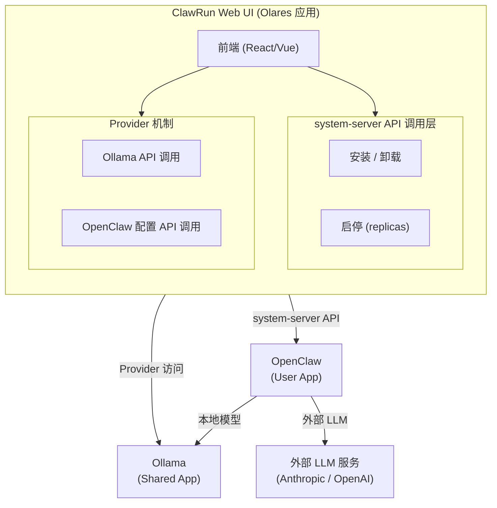

# ClawRun on Olares OS — 可行性评估

- [ClawRun on Olares OS — 可行性评估](#clawrun-on-olares-os--可行性评估)
  - [需求概述](#需求概述)
  - [总体结论：可行，但有层次差异](#总体结论可行但有层次差异)
  - [详细分析](#详细分析)
    - [1. 部署和启停 Ollama — 最简单](#1-部署和启停-ollama--最简单)
    - [2. 部署和启停 OpenClaw — 需要打包](#2-部署和启停-openclaw--需要打包)
    - [3. OpenClaw 切换外部 LLM / 本地 Ollama — Provider 机制](#3-openclaw-切换外部-llm--本地-ollama--provider-机制)
    - [4. Web UI 统一管理 — 核心挑战](#4-web-ui-统一管理--核心挑战)
  - [推荐架构](#推荐架构)
  - [建议的推进步骤](#建议的推进步骤)
  - [参考资料](#参考资料)

## 需求概述

在一个 Web UI 中完成以下功能：

1. 部署和启停 OpenClaw
2. 部署和启停 Ollama
3. OpenClaw 可选择使用外部 LLM 服务或本地 Ollama 服务

## 总体结论：可行，但有层次差异

| 需求 | 可行性 | 难度 |
|------|--------|------|
| 部署和启停 OpenClaw | 可行 | 中 |
| 部署和启停 Ollama | 可行 | 低 |
| OpenClaw 切换 LLM 来源 | 可行 | 中 |
| Web UI 统一管理 | 可行 | 中高 |

## 详细分析

### 1. 部署和启停 Ollama — 最简单

Ollama **已经是 Olares Market 的一等公民**（Shared App），内置支持：

- Market 一键安装
- GPU 分配（独占 / 时间片 / 显存切分）
- 内部 API 端点自动生成：`https://<routeID>.<username>.olares.com`，兼容 OpenAI `/v1` 接口

启停方式：

- **UI**：通过 Control Hub 设置 replicas=0 停止，恢复原值启动
- **API**：通过 `system-server` 的 `service.appstore` 接口编程控制

### 2. 部署和启停 OpenClaw — 需要打包

OpenClaw 有官方 Docker 镜像（`ghcr.io/openclaw/openclaw`），网关监听端口 18789。需要做的工作：

**打包为 OAC（Olares Application Chart）**：

- `Chart.yaml` — Helm 元数据
- `OlaresManifest.yaml` — 声明入口、权限、环境变量（`OPENCLAW_GATEWAY_TOKEN` 等）
- `templates/deployment.yaml` — 基于现有 docker-compose 转换
- `values.yaml` — 可配置参数

**关键配置点**：

- 入口声明（端口 18789，认证级别 private/internal）
- 持久化卷（`~/.openclaw` 配置目录、workspace 目录）
- 环境变量管理（API keys 通过 Olares 的 `envs` 机制或 Secrets Provider 注入）

**快速验证路径**：可先用 Olares Studio 直接从 Docker 镜像部署测试，再正式打包。

### 3. OpenClaw 切换外部 LLM / 本地 Ollama — Provider 机制

OpenClaw 本身支持多模型提供者配置和故障转移（`openclaw config set`），这是好消息。

在 Olares 中的实现路径：

```yaml
# OlaresManifest.yaml 中声明对 Ollama 的 Provider 访问
permission:
  provider:
    - appName: ollama          # 目标应用
      providerName: ollama-svc # Ollama 的服务名
```

这样 OpenClaw 容器可以直接调用集群内 Ollama 的 API。Web UI 需要提供切换界面：

- **外部 LLM**：配置 API key + endpoint（Anthropic / OpenAI 等）
- **本地 Ollama**：指向 Olares 内部的 Ollama 服务端点

### 4. Web UI 统一管理 — 核心挑战

需要构建一个 **Olares 应用**，通过 `system-server` API 管理其他应用。

**可用的 API 机制**：

```yaml
# 在 OlaresManifest.yaml 声明管理权限
permission:
  sysData:
    - group: service.appstore
      dataType: app
      version: v1
      ops:
        - InstallDevApp
        - UninstallDevApp
```

运行时自动注入 `OS_SYSTEM_SERVER`、`OS_APP_KEY`、`OS_APP_SECRET`，通过 bcrypt token 交换获取 5 分钟有效的 access token，再调用管理接口。

**API 调用流程**：

```bash
# 1. 生成 bcrypt token
now=$(date +%s)
token=$(htpasswd -nbBC 10 USER "${OS_APP_KEY}${now}${OS_APP_SECRET}" | awk -F":" '{print $2}')

# 2. 获取 access token（有效期 5 分钟）
curl -X POST http://${OS_SYSTEM_SERVER}/permission/v1alpha1/access \
  -H "content-type: application/json" \
  -d "{
    \"app_key\": \"${OS_APP_KEY}\",
    \"timestamp\": ${now},
    \"token\": \"${token}\",
    \"perm\": {
      \"group\": \"service.appstore\",
      \"dataType\": \"app\",
      \"version\": \"v1\",
      \"ops\": [\"InstallDevApp\"]
    }
  }"

# 3. 调用管理接口
curl http://${OS_SYSTEM_SERVER}/system-server/v1alpha1/<dataType>/<group>/<version>/<op> \
  -H "content-type: application/json" \
  -H "X-Access-Token: ${access_token}" \
  -d '{"data":"payload"}'
```

**现有限制**：

- `system-server` 没有公开的 OpenAPI 规范，需要参照文档和源码实现
- 安装/卸载 API 名为 `InstallDevApp` / `UninstallDevApp`，生产环境的应用管理可能需要走 Market 的内部接口
- 没有 WebSocket/事件流 API 来实时监听应用状态变化（需要轮询）

## 推荐架构



## 建议的推进步骤

1. **[先在 Olares Studio 中用 Docker 镜像部署 OpenClaw](./step1-studio-deploy-openclaw.md)**，验证基本可用性
2. **[验证 OpenClaw 连接 Ollama](./step2-provider-test.md)**，通过 Ollama 外部端点确认 OpenClaw 能调用本地模型服务
3. **[正式打包 OpenClaw 为 OAC](./step3-oac-packaging.md)**，将 Studio 部署转化为可分发的 Olares 应用包
4. **[开发 ClawRun Web UI 应用](./step4-clawrun-webui.md)**，集成 system-server API 实现管理功能

## 参考资料

- [Olares 官方文档](https://docs.olares.com/)
- [Olares 应用开发指南](https://docs.olares.com/developer/develop/)
- [OlaresManifest 规范](https://docs.olares.com/developer/develop/package/manifest.html)
- [Provider 机制](https://docs.olares.com/developer/develop/advanced/provider.html)
- [Ollama 部署指南](https://docs.olares.com/use-cases/ollama.html)
- [Control Hub 工作负载管理](https://docs.olares.com/manual/olares/controlhub/manage-workload.html)
- [OpenClaw 源码](https://github.com/openclaw/openclaw)
