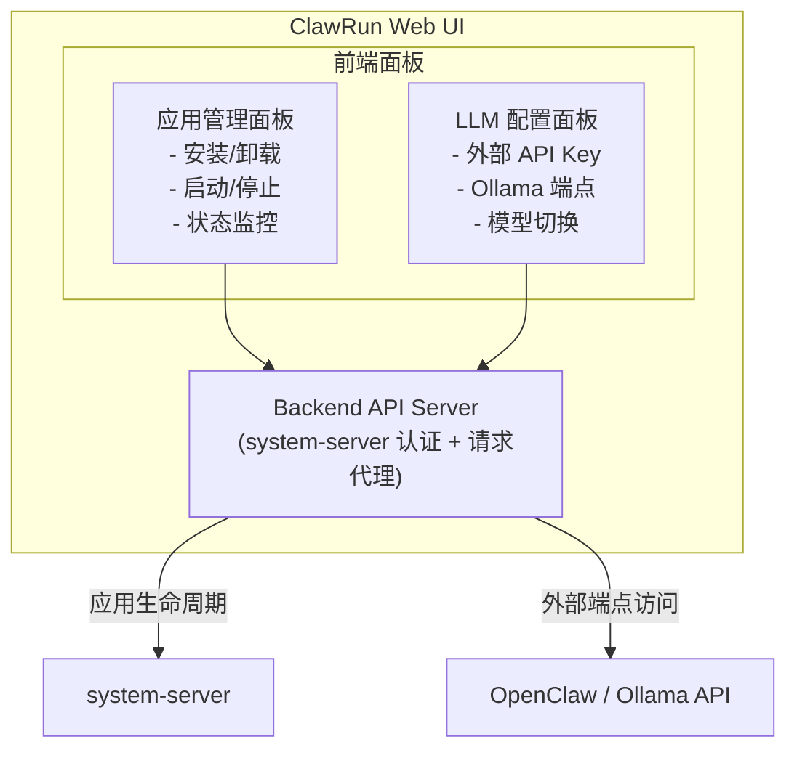
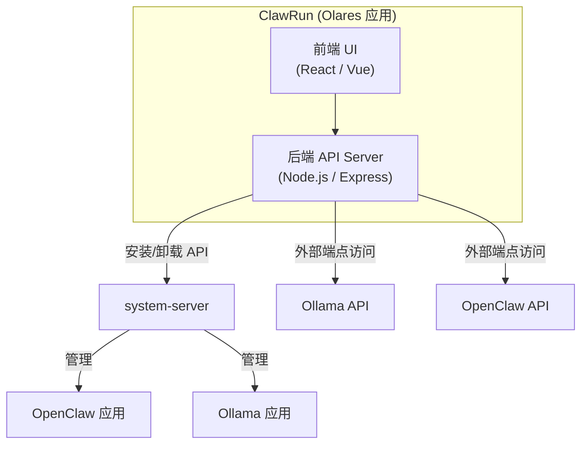

# 步骤 4：开发 ClawRun Web UI 应用

> 目标：构建 ClawRun Web UI，作为 Olares 应用部署，提供统一界面管理 OpenClaw 和 Ollama 的安装、启停及 LLM 来源切换。

- [步骤 4：开发 ClawRun Web UI 应用](#步骤-4开发-clawrun-web-ui-应用)
  - [前置条件](#前置条件)
  - [背景知识](#背景知识)
    - [ClawRun 的定位](#clawrun-的定位)
    - [system-server 认证流程](#system-server-认证流程)
    - [可用的 system-server API](#可用的-system-server-api)
  - [架构设计](#架构设计)
    - [4.1 整体架构](#41-整体架构)
    - [4.2 技术选型](#42-技术选型)
    - [4.3 项目结构](#43-项目结构)
  - [核心功能实现](#核心功能实现)
    - [4.4 system-server 认证模块](#44-system-server-认证模块)
    - [4.5 应用管理功能](#45-应用管理功能)
    - [4.6 OpenClaw 配置管理](#46-openclaw-配置管理)
    - [4.7 Ollama 模型管理](#47-ollama-模型管理)
    - [4.8 前端 UI 设计](#48-前端-ui-设计)
  - [OAC 打包](#oac-打包)
    - [4.9 OlaresManifest 权限声明](#49-olaresmanifest-权限声明)
    - [4.10 Deployment 模板](#410-deployment-模板)
  - [开发与测试](#开发与测试)
    - [4.11 构建与部署](#411-构建与部署)
    - [4.12 验证检查项](#412-验证检查项)
  - [关键发现记录](#关键发现记录)
    - [实测排查记录](#实测排查记录)

## 前置条件

- 步骤 3 已完成：OpenClaw 已打包为 OAC 并可正常安装
- Ollama 已从 Market 安装
- 熟悉 Node.js 和前端开发（React 或 Vue）

## 背景知识

### ClawRun 的定位

ClawRun 是一个 **管理类 Olares 应用**，本身不提供 AI 对话功能，而是通过 system-server API 管理其他应用的生命周期，并通过外部端点（Olares 分配的 HTTPS 域名）与 OpenClaw 和 Ollama 通信。



### system-server 认证流程

ClawRun 后端调用 system-server API 时，需要经过以下认证流程。**整个过程由后端代码自动完成**，用户无需手动操作。

> **自动化说明**：
>
> - 环境变量由 Olares 系统在应用安装时自动注入，无需手动配置
> - 令牌生成和交换在后端代码中自动执行（参见 [4.4 节](#44-system-server-认证模块)的实现）
> - access token 有效期 5 分钟，后端代码自动缓存和刷新

```
1. 读取环境变量（Olares 安装时自动注入）
   OS_SYSTEM_SERVER  →  system-server 内部地址
   OS_APP_KEY        →  ClawRun 的应用标识
   OS_APP_SECRET     →  ClawRun 的应用密钥

2. 生成 bcrypt 令牌（后端代码自动执行）
   input  = OS_APP_KEY + 当前时间戳（秒） + OS_APP_SECRET
   token  = bcrypt(input, cost=10)

3. 换取 access token（后端代码自动执行，有效期 5 分钟）
   POST http://${OS_SYSTEM_SERVER}/permission/v1alpha1/access
   Body: {
     "app_key": "${OS_APP_KEY}",
     "timestamp": 当前时间戳,
     "token": "${bcrypt_token}",
     "perm": {
       "group": "service.appstore",
       "dataType": "app",
       "version": "v1",
       "ops": ["InstallDevApp"]
     }
   }
   Response: { "data": { "access_token": "xxx" } }

4. 调用目标 API（后端代码自动执行）
   POST http://${OS_SYSTEM_SERVER}/system-server/v1alpha1/{dataType}/{group}/{version}/{op}
   Headers:
     X-Access-Token: ${access_token}
     Content-Type: application/json
```

### 可用的 system-server API

| 操作 | 端点路径 | 请求体 |
|------|---------|--------|
| 安装应用 | `/system-server/v1alpha1/app/service.appstore/v1/InstallDevApp` | `{ "appName": "openclaw", "repoUrl": "...", "source": "..." }` |
| 卸载应用 | `/system-server/v1alpha1/app/service.appstore/v1/UninstallDevApp` | `{ "name": "openclaw" }` |

> **已知限制：启停功能**
>
> system-server 目前仅暴露了 `InstallDevApp` / `UninstallDevApp` 两个应用管理 API，**没有公开的启停接口**（即无法通过 API 修改 Deployment 的 replicas）。这意味着：
>
> - ClawRun **能做到**：安装/卸载应用、配置管理、状态监控
> - ClawRun **暂时做不到**：在 Web UI 中直接启停 OpenClaw 和 Ollama
>
> 这与最初需求「在一个 Web UI 里启停应用」存在差距。
>
> **当前阶段的折中方案**：
>
> 启停操作由用户在 **Control Hub** 中手动完成（设置 replicas=0 停止，恢复原值启动）。ClawRun 通过轮询外部端点检测应用是否在线，在 UI 中显示运行状态。
>
> **后续可能的解决方向**：
>
> | 方向 | 说明 | 可行性 |
> | ------ | ------ | -------- |
> | 等待 Olares API 演进 | system-server 未来可能增加启停相关 API | 取决于 Olares 官方路线图 |
> | 研究 Control Hub 内部 API | Control Hub 本身能启停应用，其后端 API 可能可以复用 | 需要调研，API 未公开文档化 |
> | 通过 Kubernetes API 直接操作 | 在 OAC 中声明 RBAC 权限，直接调用 K8s API 修改 replicas | 技术上可行，但 Olares 可能不允许应用直接操作 K8s API |

## 架构设计

### 4.1 整体架构



ClawRun 采用前后端分离的**单容器架构**——将前端（React 构建产物）和后端（Node.js/Express）打包到同一个 Docker 镜像中，由 Node.js 进程同时提供后端 API（`/api/*`）和前端静态文件服务，对外仅暴露一个端口（3000）。

ClawRun 的 Docker 镜像需要推送到 Olares 节点可拉取的容器镜像仓库：

| 镜像仓库 | 地址格式 | 适用场景 |
|---------|---------|---------|
| GitHub Container Registry | `ghcr.io/your-org/clawrun:0.1.0` | 开源项目，与 OpenClaw 使用同一 Registry |
| Docker Hub | `docker.io/your-org/clawrun:0.1.0` | 最通用，公开镜像免费 |
| 阿里云 ACR | `registry.cn-hangzhou.aliyuncs.com/your-ns/clawrun:0.1.0` | 中国环境拉取速度快 |

> 镜像地址最终写入 OAC Deployment 模板的 `containers[].image` 字段（参见 [4.10 节](#410-deployment-模板)）。

ClawRun 包含两条通信路径：

| 路径 | 方向 | 用途 | 协议 |
|------|------|------|------|
| ClawRun → system-server | 内部通信 | 安装/卸载 OpenClaw 和 Ollama | HTTP + bcrypt 令牌认证 |
| ClawRun → OpenClaw / Ollama | 外部端点 | 健康检查、配置管理、模型列表 | HTTPS（Olares 分配的域名） |

- **前端 UI**：提供应用管理和 LLM 配置的交互界面，所有操作通过后端 API 代理
- **后端 API Server**：承担两个职责——调用 system-server 管理应用生命周期（需 bcrypt 认证），以及转发请求到 OpenClaw / Ollama 的外部端点
- **system-server**：Olares 系统服务，负责执行实际的应用安装/卸载操作
- **OpenClaw / Ollama API**：通过各自的外部 HTTPS 端点访问，用于状态监控和配置管理

### 4.2 技术选型

| 组件 | 推荐方案 | 说明 |
|------|---------|------|
| 后端 | Node.js + Express | 与 OpenClaw 技术栈一致，方便复用 bcrypt 等库 |
| 前端 | React + Tailwind CSS | 轻量、现代，适合管理面板 |
| 构建 | Vite | 快速构建，支持 React/Vue |
| 容器 | Node.js 运行后端，静态文件服务前端 | 单容器部署 |

### 4.3 项目结构

```
clawrun/
├── package.json
├── Dockerfile
├── deploy.sh                      # 构建 arm64 镜像并推送，输出 kubectl 部署命令
├── src/
│   ├── server/                    # 后端
│   │   ├── index.ts               # Express 入口
│   │   ├── auth/
│   │   │   └── system-server.ts   # system-server 认证模块
│   │   ├── routes/
│   │   │   ├── apps.ts            # 应用管理 API（安装/卸载）
│   │   │   ├── openclaw.ts        # OpenClaw 连接配置 API
│   │   │   ├── ollama.ts          # Ollama 状态 API
│   │   │   └── status.ts          # 聚合状态端点 GET /api/status
│   │   └── services/
│   │       ├── app-manager.ts     # 应用安装/卸载逻辑
│   │       ├── openclaw.ts        # OpenClaw 连接、健康检查、配置
│   │       └── ollama.ts          # Ollama 连接、模型管理
│   └── client/                    # 前端
│       ├── index.html
│       ├── App.tsx
│       ├── components/
│       │   ├── AppCard.tsx        # 应用状态卡片（含"打开 UI"按钮）
│       │   ├── ConnectPanel.tsx   # 通用连接配置表单
│       │   └── OllamaPanel.tsx    # Ollama 模型管理面板
│       └── hooks/
│           └── useAppStatus.ts    # 应用状态轮询（10s）+ 即时刷新
└── oac/                           # OAC 打包文件
    ├── Chart.yaml
    ├── OlaresManifest.yaml
    ├── values.yaml
    └── templates/
        ├── deployment.yaml
        ├── service.yaml
        ├── label-ns-job.yaml      # 为跨命名空间访问打标签
        └── rbac.yaml              # ServiceAccount + ClusterRole
```

## 核心功能实现

### 4.4 system-server 认证模块

`src/server/auth/system-server.ts`：

```typescript
import bcrypt from 'bcryptjs';

const {
  OS_SYSTEM_SERVER,
  OS_APP_KEY,
  OS_APP_SECRET,
} = process.env;

interface AccessTokenResponse {
  code: number;
  data: { access_token: string };
}

// 缓存 access token（有效期 5 分钟，提前 30 秒刷新）
let cachedToken: { token: string; expiresAt: number } | null = null;

export async function getAccessToken(
  group: string,
  dataType: string,
  version: string,
  ops: string[]
): Promise<string> {
  // 检查缓存
  if (cachedToken && Date.now() < cachedToken.expiresAt) {
    return cachedToken.token;
  }

  const timestamp = Math.floor(Date.now() / 1000);
  const input = `${OS_APP_KEY}${timestamp}${OS_APP_SECRET}`;
  const hash = await bcrypt.hash(input, 10);

  const res = await fetch(
    `http://${OS_SYSTEM_SERVER}/permission/v1alpha1/access`,
    {
      method: 'POST',
      headers: { 'Content-Type': 'application/json' },
      body: JSON.stringify({
        app_key: OS_APP_KEY,
        timestamp,
        token: hash,
        perm: { group, dataType, version, ops },
      }),
    }
  );

  const data: AccessTokenResponse = await res.json();
  if (data.code !== 0) {
    throw new Error(`Failed to get access token: ${JSON.stringify(data)}`);
  }

  // 缓存 4.5 分钟
  cachedToken = {
    token: data.data.access_token,
    expiresAt: Date.now() + 4.5 * 60 * 1000,
  };

  return cachedToken.token;
}

export async function callSystemServer(
  dataType: string,
  group: string,
  version: string,
  op: string,
  body: Record<string, unknown>
): Promise<unknown> {
  const token = await getAccessToken(group, dataType, version, [op]);

  const res = await fetch(
    `http://${OS_SYSTEM_SERVER}/system-server/v1alpha1/${dataType}/${group}/${version}/${op}`,
    {
      method: 'POST',
      headers: {
        'Content-Type': 'application/json',
        'X-Access-Token': token,
      },
      body: JSON.stringify(body),
    }
  );

  return res.json();
}
```

### 4.5 应用管理功能

`src/server/services/app-manager.ts`：

```typescript
import { callSystemServer } from '../auth/system-server';

// 安装 OpenClaw
export async function installOpenClaw(repoUrl: string) {
  return callSystemServer('app', 'service.appstore', 'v1', 'InstallDevApp', {
    appName: 'openclaw',
    repoUrl,
    source: 'custom',
  });
}

// 卸载 OpenClaw
export async function uninstallOpenClaw() {
  return callSystemServer('app', 'service.appstore', 'v1', 'UninstallDevApp', {
    name: 'openclaw',
  });
}
```

`src/server/routes/apps.ts`：

```typescript
import { Router } from 'express';
import { installOpenClaw, uninstallOpenClaw } from '../services/app-manager';

const router = Router();

// POST /api/apps/openclaw/install
router.post('/openclaw/install', async (req, res) => {
  try {
    const result = await installOpenClaw(req.body.repoUrl);
    res.json(result);
  } catch (err) {
    res.status(500).json({ error: String(err) });
  }
});

// POST /api/apps/openclaw/uninstall
router.post('/openclaw/uninstall', async (req, res) => {
  try {
    const result = await uninstallOpenClaw();
    res.json(result);
  } catch (err) {
    res.status(500).json({ error: String(err) });
  }
});

export default router;
```

### 4.6 OpenClaw 配置管理

通过 OpenClaw 的内网服务端点调用其 Gateway API，管理 LLM 提供者配置。连接信息（endpoint、token、uiUrl）持久化到 `/app/data/config.json`，Pod 重启后自动恢复：

```typescript
// src/server/services/openclaw.ts

const CONFIG_FILE = '/app/data/config.json';

// 启动时从磁盘恢复配置
const stored = loadConfig().openclaw ?? { endpoint: '', token: '', uiUrl: '' };
let endpoint = stored.endpoint;
let token = stored.token;
let uiUrl = stored.uiUrl ?? '';

export function setConnection(ep: string, tk: string, ui?: string) {
  endpoint = ep.replace(/\/$/, '');
  token = tk;
  uiUrl = (ui ?? '').replace(/\/$/, '');
  saveConfig({ openclaw: { endpoint, token, uiUrl } });
}

export function getConnection() {
  return { endpoint, token, uiUrl };
}

// 健康检查使用 wget（Node.js fetch/undici 与 Olares Envoy iptables 不兼容）
// BusyBox wget -S 将响应头输出到 stderr，重定向到 stdout 后匹配 "HTTP/"
export async function checkHealth(): Promise<boolean> {
  if (!endpoint) return false;
  return new Promise((resolve) => {
    const url = `${endpoint}/healthz`;
    exec(`wget -q -S --timeout=5 "${url}" -O /dev/null 2>&1`, { timeout: 6000 }, (_err, stdout) => {
      resolve(stdout.includes('HTTP/'));
    });
  });
}
```

> **关键设计决策**：
>
> - `endpoint`（内网）：K8s 内部服务地址（如 `http://openclaw-svc.openclaw-apepkuss:18789`），用于健康检查和 API 调用
> - `uiUrl`（外网）：Olares 分配的 HTTPS 域名（如 `https://eff9e2cb.apepkuss.olares.cn/chat`），用于"打开 UI"按钮
> - 两者必须分开存储：内网地址浏览器无法直接访问

### 4.7 Ollama 模型管理

通过 Ollama 的外部端点（Olares 分配的 HTTPS 域名）管理模型，端点地址同样持久化到 `/app/data/config.json`：

```typescript
// src/server/services/ollama.ts

const stored = (loadConfig().ollama ?? { endpoint: '' }) as { endpoint: string };
let endpoint = stored.endpoint;

export function setEndpoint(ep: string) {
  endpoint = ep.replace(/\/$/, '');
  saveConfig({ ollama: { endpoint } });
}

export function getEndpoint() { return endpoint; }

export async function checkStatus(): Promise<boolean> {
  if (!endpoint) return false;
  try {
    const res = await fetch(`${endpoint}/api/tags`, { signal: AbortSignal.timeout(5000) });
    return res.ok;
  } catch { return false; }
}

export async function listModels(): Promise<unknown> {
  const res = await fetch(`${endpoint}/api/tags`);
  if (!res.ok) throw new Error(`Ollama listModels failed: ${res.status}`);
  return res.json();
}

export async function pullModel(name: string): Promise<unknown> {
  const res = await fetch(`${endpoint}/api/pull`, {
    method: 'POST',
    headers: { 'Content-Type': 'application/json' },
    body: JSON.stringify({ name, stream: false }),
  });
  if (!res.ok) throw new Error(`Ollama pull failed: ${res.status}`);
  return res.json();
}
```

### 4.8 前端 UI 设计

ClawRun 的主界面分为两个 Tab：**应用状态** 和 **配置**。

**应用状态 Tab**：

```text
┌─────────────────────────────────────────────────────┐
│  ClawRun                    [应用状态]  [配置]       │
├─────────────────────────────────────────────────────┤
│  应用状态                                           │
│                                                     │
│  ┌─────────────────────┐ ┌─────────────────────┐   │
│  │  OpenClaw           │ │  Ollama             │   │
│  │  ● 运行中           │ │  ○ 未配置           │   │
│  │  http://...-svc:... │ │                     │   │
│  │  [打开 UI]  [卸载]  │ │  [卸载]             │   │
│  └─────────────────────┘ └─────────────────────┘   │
│                                                     │
│  ┌─ Ollama 模型管理 ──────────────────────────────┐  │
│  │  已安装模型:                                   │  │
│  │    qwen2.5:7b  [删除]                         │  │
│  │                                               │  │
│  │  拉取新模型: [llama3.2        ] [拉取]         │  │
│  └───────────────────────────────────────────────┘  │
└─────────────────────────────────────────────────────┘
```

**配置 Tab**：

```text
┌─────────────────────────────────────────────────────┐
│  连接配置                                           │
│                                                     │
│  ┌─ OpenClaw 连接 ────────────────────────────────┐  │
│  │  健康检查端点（内网）                           │  │
│  │  [http://openclaw-svc.openclaw-apepkuss:18789] │  │
│  │  Gateway Token                                 │  │
│  │  [●●●●●●●●●●●●●●●●●●●●]                      │  │
│  │  Web UI 地址（外网）                           │  │
│  │  [https://eff9e2cb.apepkuss.olares.cn/chat]   │  │
│  │  [保存]                                        │  │
│  └───────────────────────────────────────────────┘  │
│                                                     │
│  ┌─ Ollama 连接 ──────────────────────────────────┐  │
│  │  外部端点 URL                                  │  │
│  │  [https://xxxx.apepkuss.olares.cn]             │  │
│  │  [保存]                                        │  │
│  └───────────────────────────────────────────────┘  │
└─────────────────────────────────────────────────────┘
```

**关键交互逻辑**：

| 操作 | 触发的 API 调用 |
|------|----------------|
| 卸载应用 | `POST /api/apps/{name}/uninstall` → system-server UninstallDevApp |
| 打开 OpenClaw UI | `window.open(uiUrl)` 在新标签页打开外网地址 |
| 保存 OpenClaw 连接 | `POST /api/openclaw/connect` → 持久化到 `/app/data/config.json` |
| 保存 Ollama 连接 | `POST /api/ollama/connect` → 持久化到 `/app/data/config.json` |
| 查看 Ollama 模型 | `GET /api/ollama/models` → Ollama 外部端点 `/api/tags` |
| 拉取 Ollama 模型 | `POST /api/ollama/models/pull` → Ollama 外部端点 `/api/pull` |
| 状态轮询 | 前端每 10 秒调用 `/api/status`；保存配置后立即触发一次刷新 |

## OAC 打包

### 4.9 OlaresManifest 权限声明

ClawRun 需要声明以下权限才能管理其他应用：

```yaml
olaresManifest.version: '0.10.0'
olaresManifest.type: app

metadata:
  name: clawrun
  description: Manage OpenClaw and Ollama on Olares
  icon: https://example.com/clawrun-icon.png
  appid: clawrun
  version: '0.1.0'
  title: ClawRun
  categories:
    - Utilities

entrances:
  - name: clawrun-web
    port: 3000
    host: clawrun-svc
    title: ClawRun
    icon: https://example.com/clawrun-icon.png
    authLevel: private          # 管理界面需要认证
    openMethod: window

permission:
  appData: true
  appCache: true
  sysData:
    # 应用管理权限：安装/卸载
    - group: service.appstore
      dataType: app
      version: v1
      ops:
        - InstallDevApp
        - UninstallDevApp

spec:
  versionName: '0.1.0'
  fullDescription: |
    ClawRun 是 OpenClaw 和 Ollama 的统一管理界面。
    支持一键安装、状态监控、LLM 来源切换等功能。
  developer: ClawRun
  submitter: ClawRun
  locale:
    - en-US
    - zh-CN
  requiredMemory: 128Mi
  limitedMemory: 512Mi
  requiredDisk: 64Mi
  limitedDisk: 1Gi
  requiredCpu: 0.1
  limitedCpu: 1
  supportArch:
    - amd64
    - arm64

options:
  dependencies:
    - name: olares
      type: system
      version: '>=1.10.1-0'
```

> **关键权限**：
>
> `sysData` 中的 `service.appstore` 权限使 ClawRun 获得安装/卸载其他应用的能力。安装后，system-server 会自动注入 `OS_SYSTEM_SERVER`、`OS_APP_KEY`、`OS_APP_SECRET` 环境变量。

### 4.10 Deployment 模板

实际使用的 `oac/templates/deployment.yaml`（`OS_*` 变量通过 Helm values 注入，非环境变量引用）：

```yaml
apiVersion: apps/v1
kind: Deployment
metadata:
  name: {{ .Release.Name }}
  namespace: {{ .Release.Namespace }}
  labels:
    app: clawrun
spec:
  replicas: 1
  selector:
    matchLabels:
      app: clawrun
  strategy:
    type: Recreate
  template:
    metadata:
      labels:
        app: clawrun
    spec:
      containers:
        - name: clawrun
          image: "apepkuss/clawrun:0.1.0"
          imagePullPolicy: Always
          ports:
            - containerPort: 3000
              name: web
          env:
            - name: PORT
              value: "3000"
            - name: NODE_ENV
              value: "production"
            - name: OS_SYSTEM_SERVER
              value: "system-server.user-system-{{ if .Values.bfl }}{{ .Values.bfl.username }}{{ end }}"
            - name: OS_APP_KEY
              value: "{{ if .Values.os }}{{ .Values.os.appKey }}{{ end }}"
            - name: OS_APP_SECRET
              value: "{{ if .Values.os }}{{ .Values.os.appSecret }}{{ end }}"
          resources:
            requests:
              cpu: 100m
              memory: 128Mi
            limits:
              cpu: 1000m
              memory: 512Mi
          volumeMounts:
            - name: app-data
              mountPath: /app/data
      volumes:
        - name: app-data
          hostPath:
            path: "{{ .Values.userspace.appData }}/clawrun"
            type: DirectoryOrCreate
```

> **关于 `OS_*` 变量的注入方式**：Olares 通过 Helm values（`bfl.username`、`os.appKey`、`os.appSecret`）在安装时将值渲染进模板，而非运行时环境变量引用。`OS_SYSTEM_SERVER` 格式固定为 `system-server.user-system-<username>`。

## 开发与测试

### 4.11 构建与部署

**构建并推送镜像（`deploy.sh`）**：

测试节点为 Apple Silicon（arm64），构建机为 Intel x86，需指定目标平台：

```bash
cd clawrun
bash deploy.sh
```

脚本执行：`docker build --platform linux/arm64` → `docker push` → 输出 digest 和部署命令。

**在 Olares 节点上部署**：

使用脚本输出的命令，通过 digest 精确指定镜像（**不要**用 `rollout restart`，见下方排查记录）：

```bash
kubectl set image deployment/clawrun -n clawrun-apepkuss \
  clawrun="docker.io/apepkuss/clawrun@sha256:<新digest>"
```

**验证部署**：

```bash
# 确认 pod 使用的是新镜像 digest
kubectl get pod -n clawrun-apepkuss -o jsonpath='{.items[0].spec.containers[0].image}'
```

**手动测试 system-server 认证（Pod 终端内）**：

**手动测试 system-server 认证（Pod 终端内）**：

```bash
# 查看注入的环境变量
echo $OS_SYSTEM_SERVER
echo $OS_APP_KEY

# 使用 curl 测试 token 交换（需安装 htpasswd）
NOW=$(date +%s)
TOKEN=$(htpasswd -nbBC 10 USER "${OS_APP_KEY}${NOW}${OS_APP_SECRET}" | awk -F":" '{print $2}')

curl -s -X POST "http://${OS_SYSTEM_SERVER}/permission/v1alpha1/access" \
  -H "Content-Type: application/json" \
  -d "{
    \"app_key\": \"${OS_APP_KEY}\",
    \"timestamp\": ${NOW},
    \"token\": \"${TOKEN}\",
    \"perm\": {
      \"group\": \"service.appstore\",
      \"dataType\": \"app\",
      \"version\": \"v1\",
      \"ops\": [\"InstallDevApp\"]
    }
  }"
```

### 4.12 验证检查项

- [x] ClawRun 应用成功部署并可访问 Web UI
- [ ] system-server 认证流程正常（能获取 access token）
- [ ] 能通过 API 安装 OpenClaw
- [ ] 能通过 API 卸载 OpenClaw
- [x] 能检测 OpenClaw 的运行状态（Dashboard 显示"运行中"）
- [x] "打开 UI"按钮成功跳转到 OpenClaw 外网地址
- [x] 配置页面预填已保存的 endpoint 和 uiUrl，保存后状态立即刷新
- [ ] 能查看 Ollama 中已安装的模型列表（Ollama 未配置外部端点，暂跳过）
- [ ] 能在 OpenClaw 中切换 LLM 来源（外部 API / 本地 Ollama）
- [x] 前端 UI 正确显示应用状态和配置信息

## 关键发现记录

- [x] OAC 包版本号：`0.1.0`，镜像：`apepkuss/clawrun:0.1.0`

### 实测排查记录

| # | 现象 | 原因 | 解决方案 |
| --- | --- | --- | --- |
| 1 | 上传 tgz 报错：chart folder validation failed | 压缩包内目录名必须与 Chart.yaml 的 `name` 一致 | 将 `oac/` 复制为 `clawrun/` 再打包 |
| 2 | docker push 持续报 `insufficient_scope` | buildx 的 docker-container driver 无法访问 macOS Keychain 凭证 | 改用 `docker build` + `docker push`（不使用 buildx） |
| 3 | docker push 报 `access denied` | Docker Hub 用户名拼写错误（`apekuss` → `apepkuss`） | 修正用户名，重新标记镜像并创建正确的 Docker Hub 仓库 |
| 4 | QEMU 交叉编译 arm64 不稳定（EOF / overlay error） | x86 机器模拟 arm64 资源消耗大，Docker VM 不稳定 | 清理 builder 缓存（`docker builder prune -af`）后重试 |
| 5 | `kubectl rollout restart` 后 pod 仍使用旧镜像 | `rollout restart` 检查 registry manifest digest；若与本地缓存一致则不重新拉取，不保证使用最新推送 | 用 `kubectl set image deployment/clawrun ... clawrun="docker.io/apepkuss/clawrun@sha256:<digest>"` 精确指定 |
| 6 | 新 pod 一直处于 `Init:0/3`，无法创建网络沙盒 | Calico CNI node pod 的 kubeconfig token 过期，报 `Unauthorized`，导致新 pod 无法创建网络接口 | `kubectl delete pod calico-node-<name> -n kube-system` 强制刷新 token |
| 7 | "打开 UI"按钮打开内网地址（502 错误） | `uiUrl` 未保存；`ConnectPanel` 初始状态为空，用户只填 uiUrl 时 endpoint/token 为空，服务端返回 400 但客户端无错误提示 | 服务端允许复用已存储的 endpoint/token；表单预填已保存值；保存后立即刷新 React status |
| 8 | 保存配置后立即点"打开 UI"仍用旧地址 | 保存成功但 React status 未刷新（轮询间隔 10s），`status.openclaw.uiUrl` 仍为旧值 | 保存成功后调用 `refresh()` 立即重新拉取 `/api/status` |
