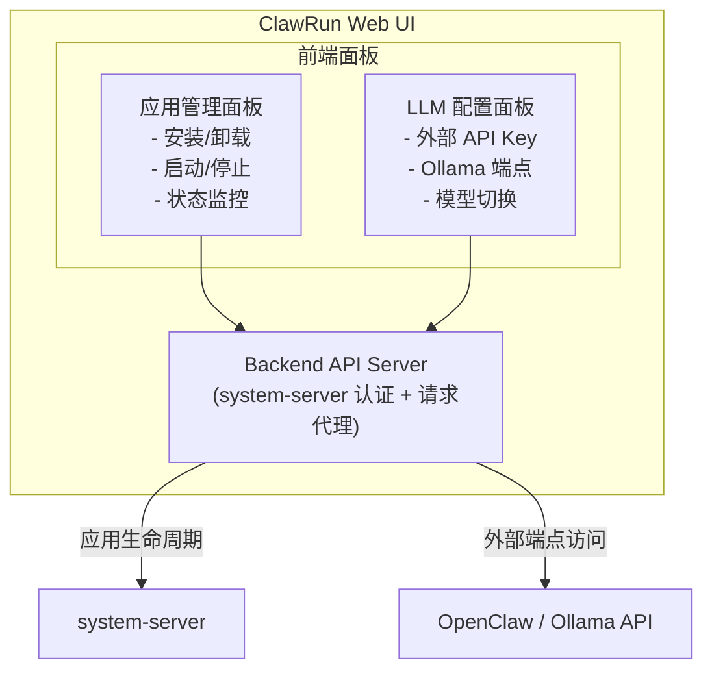
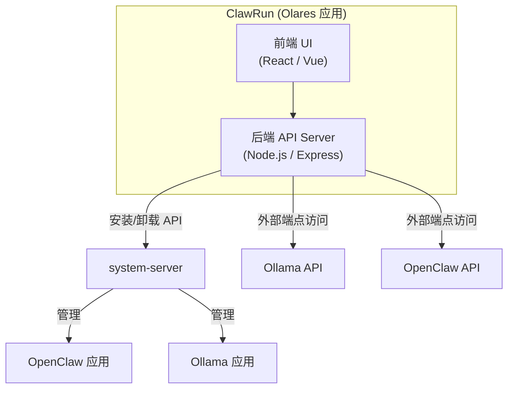

# 步骤 4：开发 ClawRun Web UI 应用

> 目标：构建 ClawRun Web UI，作为 Olares 应用部署，提供统一界面管理 OpenClaw 和 Ollama 的安装、启停及 LLM 来源切换。

- [步骤 4：开发 ClawRun Web UI 应用](#步骤-4开发-clawrun-web-ui-应用)
  - [前置条件](#前置条件)
  - [背景知识](#背景知识)
    - [ClawRun 的定位](#clawrun-的定位)
    - [system-server 认证流程](#system-server-认证流程)
    - [可用的 system-server API](#可用的-system-server-api)
  - [架构设计](#架构设计)
    - [4.1 整体架构](#41-整体架构)
    - [4.2 技术选型](#42-技术选型)
    - [4.3 项目结构](#43-项目结构)
  - [核心功能实现](#核心功能实现)
    - [4.4 system-server 认证模块](#44-system-server-认证模块)
    - [4.5 应用管理功能](#45-应用管理功能)
    - [4.6 OpenClaw 配置管理](#46-openclaw-配置管理)
    - [4.7 Ollama 模型管理](#47-ollama-模型管理)
    - [4.8 前端 UI 设计](#48-前端-ui-设计)
  - [OAC 打包](#oac-打包)
    - [4.9 OlaresManifest 权限声明](#49-olaresmanifest-权限声明)
    - [4.10 Deployment 模板](#410-deployment-模板)
  - [开发与测试](#开发与测试)
    - [4.11 使用 Studio 开发调试](#411-使用-studio-开发调试)
    - [4.12 验证检查项](#412-验证检查项)
  - [关键发现记录](#关键发现记录)

## 前置条件

- 步骤 3 已完成：OpenClaw 已打包为 OAC 并可正常安装
- Ollama 已从 Market 安装
- 熟悉 Node.js 和前端开发（React 或 Vue）

## 背景知识

### ClawRun 的定位

ClawRun 是一个 **管理类 Olares 应用**，本身不提供 AI 对话功能，而是通过 system-server API 管理其他应用的生命周期，并通过外部端点（Olares 分配的 HTTPS 域名）与 OpenClaw 和 Ollama 通信。



### system-server 认证流程

ClawRun 后端调用 system-server API 时，需要经过以下认证流程。**整个过程由后端代码自动完成**，用户无需手动操作。

> **自动化说明**：
>
> - 环境变量由 Olares 系统在应用安装时自动注入，无需手动配置
> - 令牌生成和交换在后端代码中自动执行（参见 [4.4 节](#44-system-server-认证模块)的实现）
> - access token 有效期 5 分钟，后端代码自动缓存和刷新

```
1. 读取环境变量（Olares 安装时自动注入）
   OS_SYSTEM_SERVER  →  system-server 内部地址
   OS_APP_KEY        →  ClawRun 的应用标识
   OS_APP_SECRET     →  ClawRun 的应用密钥

2. 生成 bcrypt 令牌（后端代码自动执行）
   input  = OS_APP_KEY + 当前时间戳（秒） + OS_APP_SECRET
   token  = bcrypt(input, cost=10)

3. 换取 access token（后端代码自动执行，有效期 5 分钟）
   POST http://${OS_SYSTEM_SERVER}/permission/v1alpha1/access
   Body: {
     "app_key": "${OS_APP_KEY}",
     "timestamp": 当前时间戳,
     "token": "${bcrypt_token}",
     "perm": {
       "group": "service.appstore",
       "dataType": "app",
       "version": "v1",
       "ops": ["InstallDevApp"]
     }
   }
   Response: { "data": { "access_token": "xxx" } }

4. 调用目标 API（后端代码自动执行）
   POST http://${OS_SYSTEM_SERVER}/system-server/v1alpha1/{dataType}/{group}/{version}/{op}
   Headers:
     X-Access-Token: ${access_token}
     Content-Type: application/json
```

### 可用的 system-server API

| 操作 | 端点路径 | 请求体 |
|------|---------|--------|
| 安装应用 | `/system-server/v1alpha1/app/service.appstore/v1/InstallDevApp` | `{ "appName": "openclaw", "repoUrl": "...", "source": "..." }` |
| 卸载应用 | `/system-server/v1alpha1/app/service.appstore/v1/UninstallDevApp` | `{ "name": "openclaw" }` |

> **已知限制：启停功能**
>
> system-server 目前仅暴露了 `InstallDevApp` / `UninstallDevApp` 两个应用管理 API，**没有公开的启停接口**（即无法通过 API 修改 Deployment 的 replicas）。这意味着：
>
> - ClawRun **能做到**：安装/卸载应用、配置管理、状态监控
> - ClawRun **暂时做不到**：在 Web UI 中直接启停 OpenClaw 和 Ollama
>
> 这与最初需求「在一个 Web UI 里启停应用」存在差距。
>
> **当前阶段的折中方案**：
>
> 启停操作由用户在 **Control Hub** 中手动完成（设置 replicas=0 停止，恢复原值启动）。ClawRun 通过轮询外部端点检测应用是否在线，在 UI 中显示运行状态。
>
> **后续可能的解决方向**：
>
> | 方向 | 说明 | 可行性 |
> | ------ | ------ | -------- |
> | 等待 Olares API 演进 | system-server 未来可能增加启停相关 API | 取决于 Olares 官方路线图 |
> | 研究 Control Hub 内部 API | Control Hub 本身能启停应用，其后端 API 可能可以复用 | 需要调研，API 未公开文档化 |
> | 通过 Kubernetes API 直接操作 | 在 OAC 中声明 RBAC 权限，直接调用 K8s API 修改 replicas | 技术上可行，但 Olares 可能不允许应用直接操作 K8s API |

## 架构设计

### 4.1 整体架构



ClawRun 采用前后端分离的**单容器架构**——将前端（React 构建产物）和后端（Node.js/Express）打包到同一个 Docker 镜像中，由 Node.js 进程同时提供后端 API（`/api/*`）和前端静态文件服务，对外仅暴露一个端口（3000）。

ClawRun 的 Docker 镜像需要推送到 Olares 节点可拉取的容器镜像仓库：

| 镜像仓库 | 地址格式 | 适用场景 |
|---------|---------|---------|
| GitHub Container Registry | `ghcr.io/your-org/clawrun:0.1.0` | 开源项目，与 OpenClaw 使用同一 Registry |
| Docker Hub | `docker.io/your-org/clawrun:0.1.0` | 最通用，公开镜像免费 |
| 阿里云 ACR | `registry.cn-hangzhou.aliyuncs.com/your-ns/clawrun:0.1.0` | 中国环境拉取速度快 |

> 镜像地址最终写入 OAC Deployment 模板的 `containers[].image` 字段（参见 [4.10 节](#410-deployment-模板)）。

ClawRun 包含两条通信路径：

| 路径 | 方向 | 用途 | 协议 |
|------|------|------|------|
| ClawRun → system-server | 内部通信 | 安装/卸载 OpenClaw 和 Ollama | HTTP + bcrypt 令牌认证 |
| ClawRun → OpenClaw / Ollama | 外部端点 | 健康检查、配置管理、模型列表 | HTTPS（Olares 分配的域名） |

- **前端 UI**：提供应用管理和 LLM 配置的交互界面，所有操作通过后端 API 代理
- **后端 API Server**：承担两个职责——调用 system-server 管理应用生命周期（需 bcrypt 认证），以及转发请求到 OpenClaw / Ollama 的外部端点
- **system-server**：Olares 系统服务，负责执行实际的应用安装/卸载操作
- **OpenClaw / Ollama API**：通过各自的外部 HTTPS 端点访问，用于状态监控和配置管理

### 4.2 技术选型

| 组件 | 推荐方案 | 说明 |
|------|---------|------|
| 后端 | Node.js + Express | 与 OpenClaw 技术栈一致，方便复用 bcrypt 等库 |
| 前端 | React + Tailwind CSS | 轻量、现代，适合管理面板 |
| 构建 | Vite | 快速构建，支持 React/Vue |
| 容器 | Node.js 运行后端，静态文件服务前端 | 单容器部署 |

### 4.3 项目结构

```
clawrun/
├── package.json
├── Dockerfile
├── src/
│   ├── server/                    # 后端
│   │   ├── index.ts               # Express 入口
│   │   ├── auth/
│   │   │   └── system-server.ts   # system-server 认证模块
│   │   ├── routes/
│   │   │   ├── apps.ts            # 应用管理 API
│   │   │   ├── openclaw.ts        # OpenClaw 配置 API
│   │   │   └── ollama.ts          # Ollama 状态 API
│   │   └── services/
│   │       ├── app-manager.ts     # 应用安装/卸载逻辑
│   │       ├── openclaw.ts        # OpenClaw 通信
│   │       └── ollama.ts          # Ollama 通信
│   └── client/                    # 前端
│       ├── index.html
│       ├── App.tsx
│       ├── components/
│       │   ├── AppCard.tsx        # 应用状态卡片
│       │   ├── LLMConfig.tsx      # LLM 配置面板
│       │   └── ModelSelector.tsx  # 模型选择器
│       └── hooks/
│           └── useAppStatus.ts    # 应用状态轮询
└── oac/                           # OAC 打包文件
    ├── Chart.yaml
    ├── OlaresManifest.yaml
    ├── values.yaml
    ├── owners
    └── templates/
        ├── deployment.yaml
        └── service.yaml
```

## 核心功能实现

### 4.4 system-server 认证模块

`src/server/auth/system-server.ts`：

```typescript
import bcrypt from 'bcryptjs';

const {
  OS_SYSTEM_SERVER,
  OS_APP_KEY,
  OS_APP_SECRET,
} = process.env;

interface AccessTokenResponse {
  code: number;
  data: { access_token: string };
}

// 缓存 access token（有效期 5 分钟，提前 30 秒刷新）
let cachedToken: { token: string; expiresAt: number } | null = null;

export async function getAccessToken(
  group: string,
  dataType: string,
  version: string,
  ops: string[]
): Promise<string> {
  // 检查缓存
  if (cachedToken && Date.now() < cachedToken.expiresAt) {
    return cachedToken.token;
  }

  const timestamp = Math.floor(Date.now() / 1000);
  const input = `${OS_APP_KEY}${timestamp}${OS_APP_SECRET}`;
  const hash = await bcrypt.hash(input, 10);

  const res = await fetch(
    `http://${OS_SYSTEM_SERVER}/permission/v1alpha1/access`,
    {
      method: 'POST',
      headers: { 'Content-Type': 'application/json' },
      body: JSON.stringify({
        app_key: OS_APP_KEY,
        timestamp,
        token: hash,
        perm: { group, dataType, version, ops },
      }),
    }
  );

  const data: AccessTokenResponse = await res.json();
  if (data.code !== 0) {
    throw new Error(`Failed to get access token: ${JSON.stringify(data)}`);
  }

  // 缓存 4.5 分钟
  cachedToken = {
    token: data.data.access_token,
    expiresAt: Date.now() + 4.5 * 60 * 1000,
  };

  return cachedToken.token;
}

export async function callSystemServer(
  dataType: string,
  group: string,
  version: string,
  op: string,
  body: Record<string, unknown>
): Promise<unknown> {
  const token = await getAccessToken(group, dataType, version, [op]);

  const res = await fetch(
    `http://${OS_SYSTEM_SERVER}/system-server/v1alpha1/${dataType}/${group}/${version}/${op}`,
    {
      method: 'POST',
      headers: {
        'Content-Type': 'application/json',
        'X-Access-Token': token,
      },
      body: JSON.stringify(body),
    }
  );

  return res.json();
}
```

### 4.5 应用管理功能

`src/server/services/app-manager.ts`：

```typescript
import { callSystemServer } from '../auth/system-server';

// 安装 OpenClaw
export async function installOpenClaw(repoUrl: string) {
  return callSystemServer('app', 'service.appstore', 'v1', 'InstallDevApp', {
    appName: 'openclaw',
    repoUrl,
    source: 'custom',
  });
}

// 卸载 OpenClaw
export async function uninstallOpenClaw() {
  return callSystemServer('app', 'service.appstore', 'v1', 'UninstallDevApp', {
    name: 'openclaw',
  });
}
```

`src/server/routes/apps.ts`：

```typescript
import { Router } from 'express';
import { installOpenClaw, uninstallOpenClaw } from '../services/app-manager';

const router = Router();

// POST /api/apps/openclaw/install
router.post('/openclaw/install', async (req, res) => {
  try {
    const result = await installOpenClaw(req.body.repoUrl);
    res.json(result);
  } catch (err) {
    res.status(500).json({ error: String(err) });
  }
});

// POST /api/apps/openclaw/uninstall
router.post('/openclaw/uninstall', async (req, res) => {
  try {
    const result = await uninstallOpenClaw();
    res.json(result);
  } catch (err) {
    res.status(500).json({ error: String(err) });
  }
});

export default router;
```

### 4.6 OpenClaw 配置管理

通过 OpenClaw 的外部端点调用其 Gateway API，管理 LLM 提供者配置：

```typescript
// src/server/services/openclaw.ts

// OpenClaw 外部端点地址，由用户在 ClawRun 中配置
let openclawEndpoint: string = '';
let openclawToken: string = '';

export function setOpenClawEndpoint(endpoint: string, token: string) {
  openclawEndpoint = endpoint;
  openclawToken = token;
}

// 检查 OpenClaw 健康状态
export async function checkHealth(): Promise<boolean> {
  try {
    const res = await fetch(`${openclawEndpoint}/health`, {
      headers: { Authorization: `Bearer ${openclawToken}` },
    });
    return res.ok;
  } catch {
    return false;
  }
}

// 获取当前配置
export async function getConfig(): Promise<unknown> {
  const res = await fetch(`${openclawEndpoint}/api/config`, {
    headers: { Authorization: `Bearer ${openclawToken}` },
  });
  return res.json();
}
```

### 4.7 Ollama 模型管理

通过 Ollama 的外部端点管理模型：

```typescript
// src/server/services/ollama.ts

let ollamaEndpoint: string = '';

export function setOllamaEndpoint(endpoint: string) {
  ollamaEndpoint = endpoint;
}

// 获取已安装的模型列表
export async function listModels(): Promise<unknown> {
  const res = await fetch(`${ollamaEndpoint}/api/tags`);
  return res.json();
}

// 检查 Ollama 状态
export async function checkStatus(): Promise<boolean> {
  try {
    const res = await fetch(`${ollamaEndpoint}/api/tags`);
    return res.ok;
  } catch {
    return false;
  }
}

// 拉取新模型
export async function pullModel(name: string): Promise<unknown> {
  const res = await fetch(`${ollamaEndpoint}/api/pull`, {
    method: 'POST',
    headers: { 'Content-Type': 'application/json' },
    body: JSON.stringify({ name }),
  });
  return res.json();
}
```

### 4.8 前端 UI 设计

ClawRun 的主界面分为三个区域：

```
┌─────────────────────────────────────────────────────┐
│  ClawRun                                    ⚙ 设置  │
├─────────────────────────────────────────────────────┤
│                                                     │
│  ┌─────────────────────┐ ┌─────────────────────┐   │
│  │  🔵 OpenClaw         │ │  🟢 Ollama           │   │
│  │                     │ │                     │   │
│  │  状态: 运行中        │ │  状态: 运行中        │   │
│  │  版本: 0.1.0        │ │  版本: 0.5.13       │   │
│  │                     │ │                     │   │
│  │  [打开 UI]  [卸载]  │ │  [管理模型]  [卸载]  │   │
│  └─────────────────────┘ └─────────────────────┘   │
│                                                     │
├─────────────────────────────────────────────────────┤
│  LLM 配置                                          │
│                                                     │
│  当前模型来源:  ○ 外部 LLM   ● 本地 Ollama          │
│                                                     │
│  ┌─ 外部 LLM 配置 ────────────────────────────────┐ │
│  │  Anthropic API Key:  [sk-ant-***]  ✓ 已配置    │ │
│  │  OpenAI API Key:     [未配置]                   │ │
│  │  Gemini API Key:     [未配置]                   │ │
│  └────────────────────────────────────────────────┘ │
│                                                     │
│  ┌─ Ollama 模型 ──────────────────────────────────┐ │
│  │  端点: https://a1b2c3d4.alice.olares.com       │ │
│  │                                                │ │
│  │  已安装模型:                                    │ │
│  │    ✓ qwen2.5 (4.7 GB)                         │ │
│  │    ✓ llama3.2 (2.0 GB)                        │ │
│  │                                                │ │
│  │  当前使用: [qwen2.5 ▼]                         │ │
│  └────────────────────────────────────────────────┘ │
└─────────────────────────────────────────────────────┘
```

**关键交互逻辑**：

| 操作 | 触发的 API 调用 |
|------|----------------|
| 安装 OpenClaw | `POST /api/apps/openclaw/install` → system-server InstallDevApp |
| 卸载 OpenClaw | `POST /api/apps/openclaw/uninstall` → system-server UninstallDevApp |
| 查看 OpenClaw 状态 | `GET /api/openclaw/health` → OpenClaw 外部端点 |
| 切换到 Ollama | `POST /api/openclaw/config` → 修改 OpenClaw 的 models.providers 配置 |
| 查看 Ollama 模型 | `GET /api/ollama/models` → Ollama 外部端点 `/api/tags` |
| 拉取 Ollama 模型 | `POST /api/ollama/models/pull` → Ollama 外部端点 `/api/pull` |
| 状态轮询 | 前端每 10 秒调用 `/api/status` 获取两个应用的状态 |

## OAC 打包

### 4.9 OlaresManifest 权限声明

ClawRun 需要声明以下权限才能管理其他应用：

```yaml
olaresManifest.version: '0.10.0'
olaresManifest.type: app

metadata:
  name: clawrun
  description: Manage OpenClaw and Ollama on Olares
  icon: https://example.com/clawrun-icon.png
  appid: clawrun
  version: '0.1.0'
  title: ClawRun
  categories:
    - Utilities

entrances:
  - name: clawrun-web
    port: 3000
    host: clawrun-svc
    title: ClawRun
    icon: https://example.com/clawrun-icon.png
    authLevel: private          # 管理界面需要认证
    openMethod: window

permission:
  appData: true
  appCache: true
  sysData:
    # 应用管理权限：安装/卸载
    - group: service.appstore
      dataType: app
      version: v1
      ops:
        - InstallDevApp
        - UninstallDevApp

spec:
  versionName: '0.1.0'
  fullDescription: |
    ClawRun 是 OpenClaw 和 Ollama 的统一管理界面。
    支持一键安装、状态监控、LLM 来源切换等功能。
  developer: ClawRun
  submitter: ClawRun
  locale:
    - en-US
    - zh-CN
  requiredMemory: 128Mi
  limitedMemory: 512Mi
  requiredDisk: 64Mi
  limitedDisk: 1Gi
  requiredCpu: 0.1
  limitedCpu: 1
  supportArch:
    - amd64
    - arm64

options:
  dependencies:
    - name: olares
      type: system
      version: '>=1.10.1-0'
```

> **关键权限**：
>
> `sysData` 中的 `service.appstore` 权限使 ClawRun 获得安装/卸载其他应用的能力。安装后，system-server 会自动注入 `OS_SYSTEM_SERVER`、`OS_APP_KEY`、`OS_APP_SECRET` 环境变量。

### 4.10 Deployment 模板

```yaml
apiVersion: apps/v1
kind: Deployment
metadata:
  name: {{ .Release.Name }}
  namespace: {{ .Release.Namespace }}
  labels:
    app: clawrun
spec:
  replicas: 1
  selector:
    matchLabels:
      app: clawrun
  template:
    metadata:
      labels:
        app: clawrun
    spec:
      containers:
        - name: clawrun
          image: "ghcr.io/clawrun/clawrun:0.1.0"    # 需构建并推送
          ports:
            - containerPort: 3000
          env:
            # system-server 凭证（系统自动注入，此处显式声明以供参考）
            - name: OS_SYSTEM_SERVER
              value: "$(OS_SYSTEM_SERVER)"
            - name: OS_APP_KEY
              value: "$(OS_APP_KEY)"
            - name: OS_APP_SECRET
              value: "$(OS_APP_SECRET)"
          resources:
            requests:
              cpu: 100m
              memory: 128Mi
            limits:
              cpu: 1000m
              memory: 512Mi
          volumeMounts:
            - name: data
              mountPath: /app/data
      volumes:
        - name: data
          hostPath:
            path: "{{ .Values.userspace.appData }}/clawrun"
            type: DirectoryOrCreate
---
apiVersion: v1
kind: Service
metadata:
  name: clawrun-svc
  namespace: {{ .Release.Namespace }}
spec:
  type: ClusterIP
  selector:
    app: clawrun
  ports:
    - protocol: TCP
      port: 3000
      targetPort: 3000
```

> **关于 `OS_*` 环境变量**：Olares 系统会在应用安装时自动向容器注入 `OS_SYSTEM_SERVER`、`OS_APP_KEY`、`OS_APP_SECRET`。上面的 `env` 声明用于说明目的，实际部署中这些变量由系统注入，无需在模板中显式定义。

## 开发与测试

### 4.11 使用 Studio 开发调试

推荐使用 Olares Studio 进行开发迭代：

1. **构建 Docker 镜像**：本地构建 ClawRun 镜像并推送到 registry
2. **Studio 部署**：在 Studio 中使用该镜像快速部署
3. **Dev Container**：通过 Studio 的 Dev Container 功能进入开发环境，实时修改和调试代码
4. **验证 API**：在 Pod 终端中手动测试 system-server 认证和 API 调用

**手动测试 system-server 认证（Pod 终端内）**：

```bash
# 查看注入的环境变量
echo $OS_SYSTEM_SERVER
echo $OS_APP_KEY

# 使用 curl 测试 token 交换（需安装 htpasswd）
NOW=$(date +%s)
TOKEN=$(htpasswd -nbBC 10 USER "${OS_APP_KEY}${NOW}${OS_APP_SECRET}" | awk -F":" '{print $2}')

curl -s -X POST "http://${OS_SYSTEM_SERVER}/permission/v1alpha1/access" \
  -H "Content-Type: application/json" \
  -d "{
    \"app_key\": \"${OS_APP_KEY}\",
    \"timestamp\": ${NOW},
    \"token\": \"${TOKEN}\",
    \"perm\": {
      \"group\": \"service.appstore\",
      \"dataType\": \"app\",
      \"version\": \"v1\",
      \"ops\": [\"InstallDevApp\"]
    }
  }"
```

### 4.12 验证检查项

- [ ] ClawRun 应用成功部署并可访问 Web UI
- [ ] system-server 认证流程正常（能获取 access token）
- [ ] 能通过 API 安装 OpenClaw
- [ ] 能通过 API 卸载 OpenClaw
- [ ] 能检测 OpenClaw 和 Ollama 的运行状态
- [ ] 能查看 Ollama 中已安装的模型列表
- [ ] 能在 OpenClaw 中切换 LLM 来源（外部 API / 本地 Ollama）
- [ ] 前端 UI 正确显示应用状态和配置信息

## 关键发现记录

完成开发和测试后，记录以下信息：

- [ ] system-server API 实际调用结果：`___________________________`
- [ ] 认证流程中遇到的问题：`___________________________`
- [ ] 启停功能的实现方案：`___________________________`
- [ ] 前端与后端的通信方式和遇到的 CORS 问题：`___________________________`
- [ ] 尚未实现的功能和后续计划：`___________________________`
